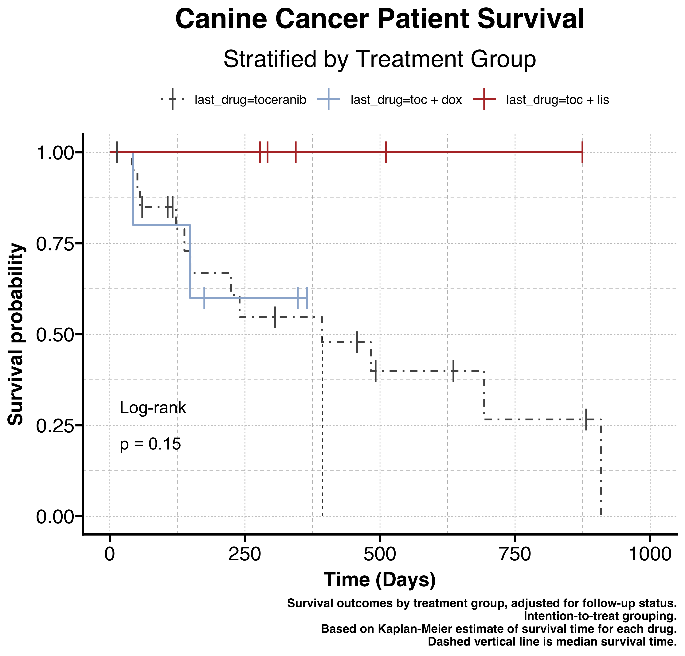
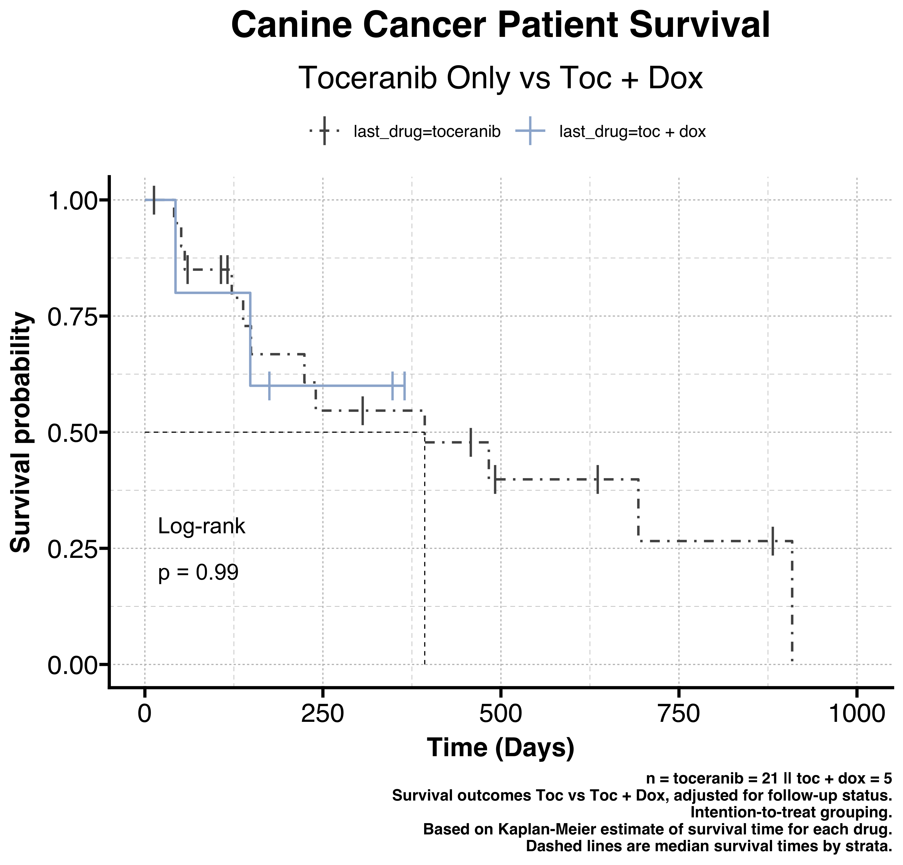
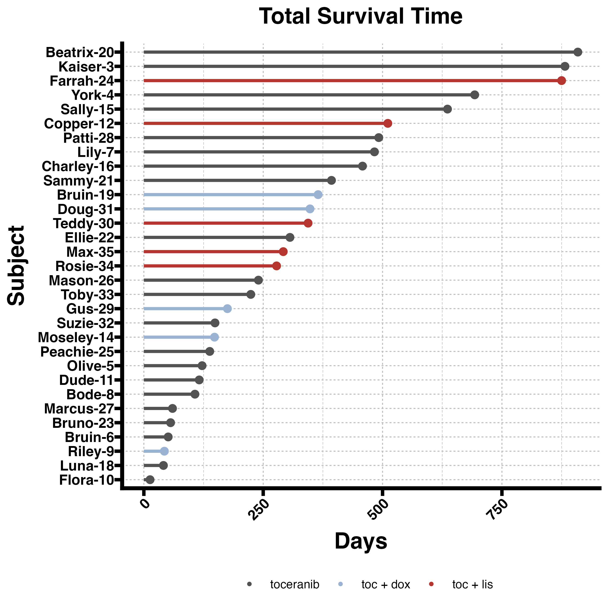

# Canine Survival Analysis

This repository contains analysis code for the survival analysis of our canine study included in our manuscript [DOI]. The analysis was performed using R-4.2.3 (arm64).

## Overview

The project includes scripts for data preparation, survival analysis, and result visualization. Key components include:

- **Data Preparation**: Scripts for cleaning and preparing data for analysis.
- **Survival Analysis**: Implementation of survival analysis, comparing survival times across the different treatment groups.
- **Visualization**: Generation of plots to visualize survival by subject and KM survival curves.

## Repository Structure

- `canine_survival_analysis.R`: Main script for survival analysis.
- `helper_script.R`: Contains helper functions used across the analysis.
- `data/`: Directory containing raw data files.
- `survival_results/`: Output directory for analysis results, including generated plots.

## How to Use

To run the analysis, follow these steps:

1. Ensure you have R installed on your system.
2. Install required R packages: `tidyverse`, `readxl`, `GetoptLong`, `openxlsx`, `ggprism`, `broom.mixed`, `ggalt`, `survival`, `ggsurvfit`, and `survminer`:
```r
install.packages(c("tidyverse", "readxl", "GetoptLong", "openxlsx", "ggprism", "broom.mixed", "ggalt", "survival", "ggsurvfit", "survminer"))
```
4. Clone this repository to your local machine.
5. Set your working directory to the cloned repository's root.
6. Run `canine_survival_analysis.R` script in R or RStudio.

## Results

The analysis generates several plots saved in the `survival_results/plots/` directory. Here are some of the key findings visualized:

### All Treatments Survival Plot


### Doxazosin vs Lisinopril Survival Plot


### Toceranib vs Doxazosin Survival Plot


### Toceranib vs Lisinopril Survival Plot


### Survival Lollipop Plot



## Session Info

```R
r$> sessionInfo()
R version 4.2.3 (2023-03-15)
Platform: aarch64-apple-darwin20 (64-bit)
Running under: macOS 14.2.1

Matrix products: default
LAPACK: /Library/Frameworks/R.framework/Versions/4.2-arm64/Resources/lib/libRlapack.dylib

locale:
[1] en_US.UTF-8/en_US.UTF-8/en_US.UTF-8/C/en_US.UTF-8/en_US.UTF-8

attached base packages:
[1] stats     graphics  grDevices utils     datasets  methods   base     

other attached packages:
 [1] survminer_0.4.9     ggpubr_0.6.0        ggsurvfit_1.0.0     survival_3.5-8      ggalt_0.4.0         broom.mixed_0.2.9.4 ggprism_1.0.4       openxlsx_4.2.5.2    GetoptLong_1.0.5    readxl_1.4.3        lubridate_1.9.3    
[12] forcats_1.0.0       stringr_1.5.1       dplyr_1.1.4         purrr_1.0.2         readr_2.1.4         tidyr_1.3.0         tibble_3.2.1        ggplot2_3.4.4       tidyverse_2.0.0    

loaded via a namespace (and not attached):
 [1] maps_3.4.2          jsonlite_1.8.8      splines_4.2.3       carData_3.0-5       cellranger_1.1.0    globals_0.16.2      Rttf2pt1_1.3.12     pillar_1.9.0        backports_1.4.1     lattice_0.22-5      glue_1.6.2         
[12] extrafontdb_1.0     digest_0.6.33       RColorBrewer_1.1-3  ggsignif_0.6.4      colorspace_2.1-0    Matrix_1.6-4        pkgconfig_2.0.3     broom_1.0.5         listenv_0.9.0       xtable_1.8-4        scales_1.3.0       
[23] km.ci_0.5-6         KMsurv_0.1-5        tzdb_0.4.0          timechange_0.2.0    generics_0.1.3      car_3.1-2           withr_2.5.2         furrr_0.3.1         cli_3.6.2           magrittr_2.0.3      crayon_1.5.2       
[34] ash_1.0-15          future_1.33.1       fansi_1.0.6         parallelly_1.36.0   nlme_3.1-164        MASS_7.3-60         rstatix_0.7.2       data.table_1.14.10  tools_4.2.3         hms_1.1.3           GlobalOptions_0.1.2
[45] lifecycle_1.0.4     munsell_0.5.0       zip_2.3.0           compiler_4.2.3      rlang_1.1.2         grid_4.2.3          rjson_0.2.21        proj4_1.0-14        gtable_0.3.4        codetools_0.2-19    abind_1.4-5        
[56] R6_2.5.1            zoo_1.8-12          gridExtra_2.3       knitr_1.45          survMisc_0.5.6      extrafont_0.19      utf8_1.2.4          KernSmooth_2.23-22  stringi_1.8.3       parallel_4.2.3      Rcpp_1.0.11        
[67] vctrs_0.6.5         xfun_0.41           tidyselect_1.2.0
```

## License

This project is licensed under the MIT License - see the [LICENSE](LICENSE) file for details.
